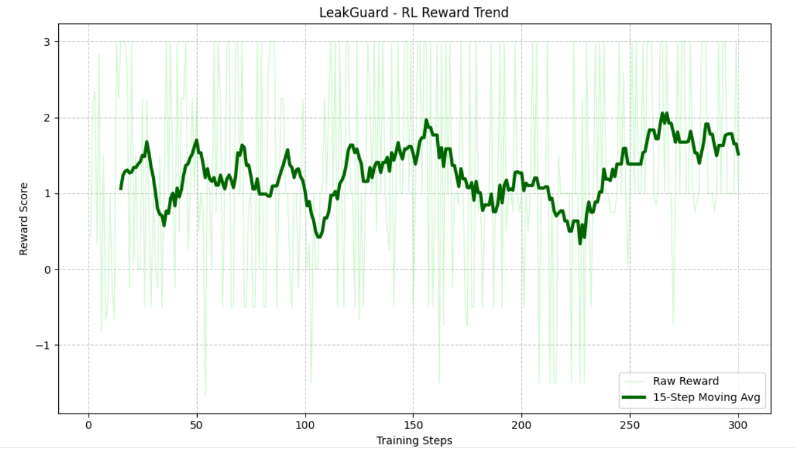
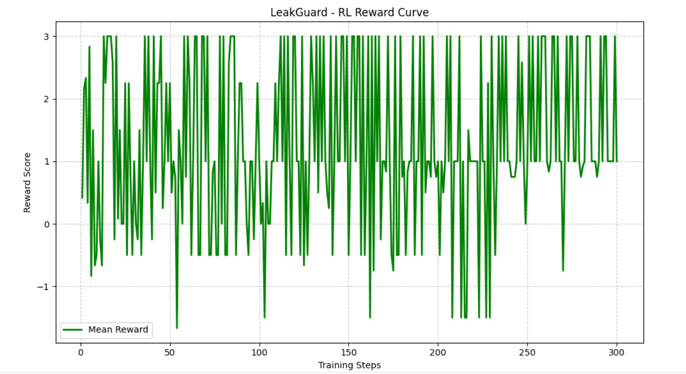
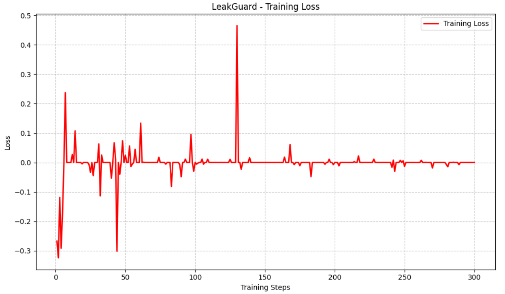

# 🛡️ LeakGuard: Intelligent RL Auditor

**Submission for MetaxScalarxPytorch Hackathon** An end-to-end supply-chain anomaly detection environment and a custom Reinforcement Learning (RL) agent, built on the Meta PyTorch **OpenEnv** framework.

🔗 **Quick Links:**
* **Trained Model Weights (LoRA):** [AtulK29/LeakGuard-3B-Auditor-L2](https://huggingface.co/AtulK29/LeakGuard-3B-Auditor-L2)
* **Live Environment API:** [AtulK29/LGDemo](https://atulk29-lgdemo.hf.space/docs) (Direct URL)
* **Hugging Face Space:** [Atulk29/LGDemo](https://huggingface.co/spaces/AtulK29/LGDemo)
* **Github Repository:** [Leakguarddemo](https://github.com/Atul-Kumar29/LGworking) 
* **Training Notebook:** [Kaggle RL Pipeline](https://www.kaggle.com/code/atulkumar29/notebook9ac1f1bb95)

---

## 📌 The Problem: "Majority Class Collapse"
Most LLMs make terrible financial auditors. When tasked with finding revenue leaks (e.g., over-billing), standard Supervised Fine-Tuning (SFT) models suffer from "Majority Class Collapse." Because 90% of real-world invoices are clean, the LLM simply learns to rubber-stamp `APPROVE` on everything, ignoring the nuanced math.

**Our objective:** Build an agent that actively hunts for discrepancies and understands mathematical thresholds, rather than just guessing labels.

---

## 🧠 Our Solution: GRPO & The "Strict Boss" Matrix

To cure the model's laziness, we moved away from SFT and utilized **Reinforcement Learning** via **GRPO (Group Relative Policy Optimization)**. 

### 1. The Core Logic (The 15% Rule)
We built an adversarial OpenEnv simulation where invoices are dynamically generated. A "Leak" is mathematically defined as any invoice where the billed amount exceeds the market benchmark by **>15%**, or if it lacks a valid Goods Receipt Note (GRN). We did *not* tell the model this rule directly; it had to discover it through trial and error.

### 2. The Model & Training Framework
* **Base Architecture:** `Llama-3.2-3B-Instruct`
* **Framework:** Unsloth for ultra-fast, memory-efficient LoRA training.
* **Temperature Injection:** We trained with high entropy (`temp=1.3`) to force the model to explore mathematical boundaries instead of collapsing into repetitive approvals.

### 3. The Reward Matrix
We implemented a strict, non-clamped reward function to shape the model's financial intuition:
* **+2.0 (Massive Win):** Successfully using `FLAG_FOR_AUDIT` on a hidden 15%+ markup.
* **+0.5 (Standard):** Correctly approving a valid invoice.
* **-2.5 (Critical Penalty):** Approving an invoice with a missing GRN or high markup (Leaking Revenue).
* **-1.0 (False Alarm):** Flagging a perfectly fine vendor (Hurts Trust Score).

---

## 📈 Training Evidence & Convergence

By exposing the 3B model to this harsh environment, it successfully deduced the underlying supply-chain logic. 

### 1. The Smoothed Reward Trend (The "Aha!" Moment)


> **Analysis:** Despite the high-temperature exploration, the 15-step moving average shows a definitive upward trajectory. Around Step 150, the agent stops randomly guessing and consistently starts hunting high-markup invoices to achieve the maximum `+3.0` payout per step.

### 2. The Raw Reward Distribution


> **Analysis:** The dense clustering of peaks hitting the upper bound on the right half of the graph visualizes the GRPO algorithm successfully shifting the policy toward the optimal auditing strategy.

### 3. Training Loss


> **Analysis:** The surrogate policy objective remains highly stable (hovering near 0.0), indicating safe weight updates without catastrophic forgetting of its base instruction-following capabilities.

---

## ⚙️ Environment Action Space

The agent interacts with the `OpenEnv` FastAPI server using strict JSON outputs. 
1. **Standard Audit:** `{"invoice_id": <int>, "decision": "<APPROVE|FLAG_FOR_AUDIT|REJECT>"}`
2. **Negotiate:** `{"invoice_id": <int>, "decision": "NEGOTIATE", "discount_pct": <float>}`
3. **Investigate (Token Penalty):** `{"decision": "SEARCH_WEB", "item_name": "<string>"}`

---

## 🚀 Evaluation Guide for Judges

We have optimized the environment for automated grading scripts. 

### 1. Automated Script Targeting (Important!)
Because Hugging Face wraps Spaces in an iframe, automated scripts hitting `huggingface.co/spaces/...` will receive a 404. **Your automated scripts must target the direct underlying container URL:**

👉 **Target API Base:** `https://atulk29-lgdemo.hf.space`

**Example Automated Step:**
```bash
curl -X POST "[https://atulk29-lgdemo.hf.space/step](https://atulk29-lgdemo.hf.space/step)" \
     -H "Content-Type: application/json" \
     -d "{\"invoice_id\": 1, \"decision\": \"APPROVE\"}"
```

### 2. Using our Provided Inference Script
You can test the actual trained 3B brain against the live environment by running our provided client:

```bash
# Install dependencies
pip install torch transformers peft requests

# Run the evaluation (Downloads the adapter from HF Hub)
python inference.py
```

### 3. Swagger UI Exploration
To manually inspect the API endpoints (`/reset`, `/step`, `/state`), visit the direct docs URL:
[https://atulk29-lgdemo.hf.space/docs](https://atulk29-lgdemo.hf.space/docs)
